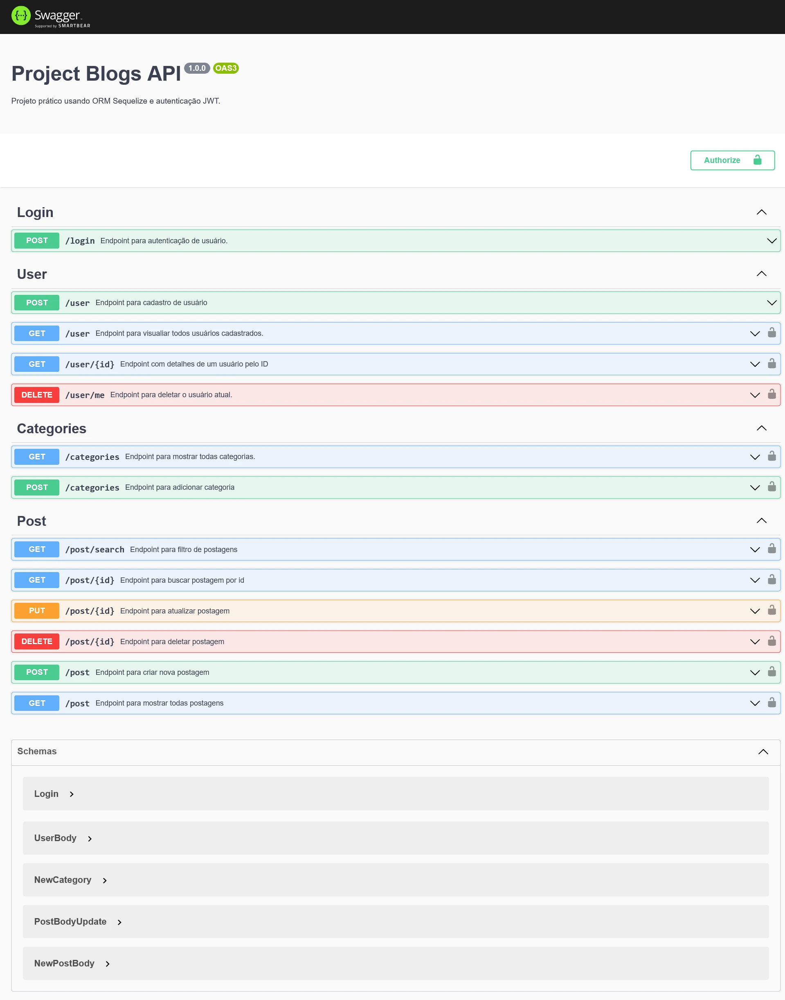
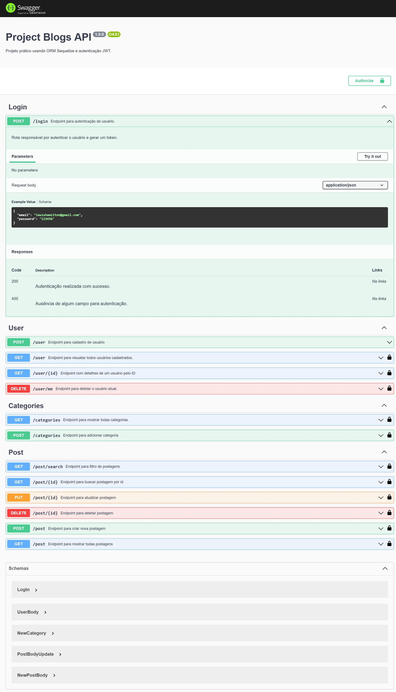
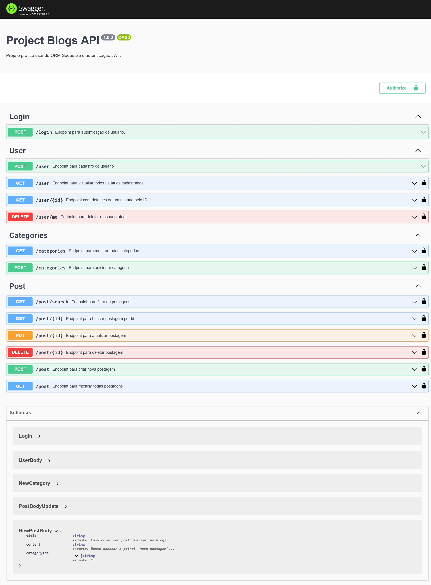

# Sobre

## Seção: `ORM e Autenticação`

- Introdução a ORM(Object Relational Mapping), onde é possivel alterar, realizar consultas, inserir e extrair dados do banco com foco na biblioteca do Sequelize.
- Importância sobre autenticação usando JSON Web Token(JWT).

#
<div align="center">
  <a href="https://raw.githubusercontent.com/davidrogger/trybe-project-blogs-api/readme-update/readme-imgs/project_top.webp">
    
  </a>
  <a href="https://raw.githubusercontent.com/davidrogger/trybe-project-blogs-api/readme-update/readme-imgs/project_mid.webp">
    
  </a>
  <a href="https://raw.githubusercontent.com/davidrogger/trybe-project-blogs-api/readme-update/readme-imgs/project_bot.webp">
    
  </a>
</div>

>*Imagens da documentação swagger*
#
## Projeto: `Blogs API`

- Desenvolvido uma API e um banco de dados para simular um blog. Usando a ORM sequelize para fazer o CRUD das postagem e autenticação usando JWT.

# Tecnologias e ferramentas usadas 🛠


# Desafios

- Configuração initial do **sequelize** definindo todos arquivos iniciais necessários, começando pelas migrations que criam as tabelas no banco de dados, seguinde dos models, que são usados quando vamos usar alguma funcionalidade do sequelize e os seeders(ja criados pela trybe), para "alimentar" o banco com informação e a association que define a relação entre uma tabela e outra quando há alguma, de forma a facilitar a coleta mesclada de informação entre tabelas quando necessário.
- Usando JWT para autenticar o usuário que está acessando aquela determinada rota por meio de middleware, checando se o usuário é valido e tem permissão para aquele dado.

# Conclusão

- O uso de ORM é complicado no inicio da aplicação por falta de experiência com a ferramenta, e dependendo da dimensão da aplicação cai aquela pergunta, se realmente era necessário o uso dela, mas fica claro o quão útil e prático ela pode ser na hora de apagar e reiniciar as informação do banco e consulta-las, talvez não da forma mais performática, e caso seja necessário a mudança de um banco, mudando apenas uma palavra na configuração do sequelize, poderiamos mudar de **mysql** para **postgres** instantaneamente sem nenhum trabalho adicional.

</details>

<details>
  <summary>
    <strong>
      :newspaper_roll: Requisitos solicitados durante o desenvolvimento do projeto
    </strong>
  </summary>

 
  ### Requisitos
  *Nome* | *Avaliação*
  --- | :---:
  1 - Crie migrations para as entidades User, Categories, BlogPosts e PostCategories | :heavy_check_mark:
  2 - Crie o modelo 'User' em 'src/database/models/user.js' com as propriedades corretas | :heavy_check_mark:
  3 - Sua aplicação deve ter o endpoint POST `/login` | :heavy_check_mark:
  4 - Sua aplicação deve ter o endpoint POST `/user` | :heavy_check_mark:
  5 - Sua aplicação deve ter o endpoint GET `/user` | :heavy_check_mark:
  6 - Sua aplicação deve ter o endpoint GET `/user/:id` | :heavy_check_mark:
  7 - Crie o modelo 'Category' em 'src/database/models/category.js' com as propriedades corretas | :heavy_check_mark:
  8 - Sua aplicação deve ter o endpoint POST `/categories` | :heavy_check_mark:
  9 - Sua aplicação deve ter o endpoint GET `/categories` | :heavy_check_mark:
  10 - Crie o modelo 'BlogPost' em 'src/database/models/blogPost.js' com as propriedades e associações corretas | :heavy_check_mark:
  11 - Crie o modelo 'PostCategory' em 'src/database/models/postCategory.js' com as propriedades e associações corretas | :heavy_check_mark:
  12 - Sua aplicação deve ter o endpoint POST `/post` | :heavy_check_mark:
  13 - Sua aplicação deve ter o endpoint GET `/post` | :heavy_check_mark:
  14 - Sua aplicação deve ter o endpoint GET `post/:id` | :heavy_check_mark:
  15 - Sua aplicação deve ter o endpoint PUT `/post/:id` | :heavy_check_mark:
  16 - Sua aplicação deve ter o endpoint DELETE `post/:id` | :heavy_check_mark:
  17 - Sua aplicação deve ter o endpoint DELETE `/user/me` | :heavy_check_mark:
  18 - Sua aplicação deve ter o endpoint GET `post/search?q=:searchTerm` | :heavy_check_mark:


</details>

<details>
  <summary>
    <strong>
      :memo: Todo list
    </strong>
  </summary>

  - [x] - ~~Criar aplicação com base nos requisitos da trybe.~~ 

</details>

<details>
  <summary>
    <strong>
      :computer: Instruções do  Projeto
    </strong>
  </summary>

> ### Importante seguir a ordem apresentada a baixo, para o funcionamento.

<details>
<summary>
  <strong>
    ⚠️ Configurações mínimas para execução do projeto
  </strong>
</summary>

  > - Sistema Operacional Distribuição Unix
  > - Node versão >= 16
  > - Docker
  > - Docker-compose versão >=1.29.2
  > - API Client ([Thunder Client](https://www.thunderclient.com/), [Insomnia](https://insomnia.rest/), [POSTMAN](https://www.postman.com/), ou algum outro de sua preferência)

  </details>

  
  <details>
  <summary>
    <strong>
      ⚙️ Variáveis de ambiente
    </strong>
  </summary>

  >Deve-se remover a extensão `sample` do arquivo .env na raiz do projeto com o seguinte conteúdo:
  >```
  >#### SERVER VARS
  >NODE_ENV=development
  >API_PORT=3000
  >
  >#### DATABASE VARS
  >MYSQL_HOST=localhost
  >MYSQL_PORT=3306
  >MYSQL_DB_NAME=blogs-api
  >MYSQL_USER=root
  >MYSQL_PASSWORD=password
  >
  >#### SECRECT VARS
  >JWT_SECRET=suaSenhaSecreta
  >```
  </details>


  <details>
  <summary>
    <strong>
      ⚠️ Inicie o docker-compose
    </strong>
  </summary>

  >Após clonar o respositório para iniciar o docker compose, você deve dentro da pasta raiz do projeto usar o comando: `docker-compose up -d`
  >Verifique os containers usando o comando `docker ps` no terminal. Deve aparecer dois containers com o nome de *blogs_api* e *blogs_api_db*.
  </details>

  <details>
    <summary>
      <strong>
        🗂 Acessando as Rotas
      </strong>
    </summary>

  >Para acessar e testar as rotas:
  >1. Usando algum API Cliente, conforme citado nas configurações mínimas.
  >2. Acessando a documentação gerada pelo swagger `localhost:3000/api-docs`.

  
  <details>
  <summary>
      <span>Endpoint <code>/login</code></span>
  </summary>

  ## POST - `localhost:3000/login`

  > - Rota responsável autenticar usuário e gerar token.
  > - Para autenticar o usuário, é necessário realizar uma requisição POST para URL: `localhost:3000/login` contendo um corpo json com o `e-mail` e `senha` válidos. Usuário deve estar cadastrado para ser considerado válido os dados fornecidos no corpo.
  > ### Exemplo:
  >```
  >{
  >  "email": "lewishamilton@gmail.com",
  >  "password": "123456"
  >}
  >```
  > ### Status:
  > - **`200`**: Retorna um json com o token para acessar rotas que precisam de autenticação.
  > - **`400`**: Retorna um json com a mensagem `Invalid fields`.

  </details>

  
  <details>
  <summary>
      <span>Endpoint <code>/user</code></span>
  </summary>

  ## POST - `localhost:3000/user`

  > - Rota responsável cadastrar usuário e gerar token.
  > - Para cadastrar o usuário, é necessário realizar uma requisição POST para URL: `localhost:3000/user` contendo um corpo json válido.
  > ### Exemplo:
  >```
  >{
  >  "displayName": "Jonas Doe",
  >  "email": "jonas@doc.com",
  >  "password": "123456",
  >  "image": "None"
  >}
  >```
  > ### Status:
  > - **`201`**: Retorna um json com o token para acessar rotas que precisam de autenticação.
  > - **`400`**: Retorna um json com uma mensagem com o campo ausênte na requisição.
  > - **`409`**: Retorna um json com uma mensagem "User already registered".

  ## GET - `localhost:3000/user`

  > - Rota responsável mostrar todos usuários cadastrados.
  > - É necessário adicionar ao headers o token para executar esta requisição.
  > - Para buscar, é necessário realizar uma requisição GET.
  > ### Exemplo:
  >```
  >localhost:3000/user
  >```
  > ### Status:
  > - **`200`**: Retorna um json com listagem de todos usuários.
  > - **`401`**: Retorna um json com a mensagem `Token not found`.

  ## GET - `localhost:3000/user/:id`

  > - Rota responsável por mostrar detalhes de um usuário por seu *id*.
  > - Para buscar o usuário, é necessário realizar uma requisição GET usando o parametro com o ID.
  > ### Exemplo:
  >```
  >localhost:3000/user/1
  >```
  > ### Status:
  > - **`200`**: Retorna um json com detalhes do usuário.
  > - **`401`**: Retorna um json com a mensagem `Token not found`.
  > - **`404`**: Retorna um json com a mensagem `User does not exist`.

  ## DELETE - `localhost:3000/user/me`

  > - Rota responsável deletar o usuário logado.
  > - Para deletar o usuário, é necessário realizar uma requisição DELETE.
  > ### Exemplo:
  >```
  >localhost:3000/user/me
  >```
  > ### Status:
  > - **`204`**: Retorna status 204(no content).
  > - **`401`**: Retorna um json com a mensagem `Token not found`.

  </details>

  
  <details>
  <summary>
      <span>Endpoint <code>/categories</code></span>
  </summary>

  ## GET - `localhost:3000/categories`

  > - Rota responsável por mostrar todas categorias cadastradas.
  > - É necessário adicionar ao headers o token para executar esta requisição.
  > - Para buscar as categorias, é necessário realizar uma requisição GET.
  > ### Exemplo:
  >```
  >localhost:3000/categories
  >```
  > ### Status:
  > - **`200`**: Retorna um json com todas categorias.
  > - **`401`**: Retorna um json com a mensagem `Token not found`.

  ## POST - `localhost:3000/categories`

  > - Rota responsável cadastrar uma categoria.
  > - É necessário adicionar ao headers o token para executar esta requisição.
  > - Para cadastrar uma nova categoria, é necessário realizar uma requisição POST para URL: `localhost:3000/categories` contendo um corpo json válido.
  > ### Exemplo:
  >```
  >{
  >  "name": "Jogos"
  >}
  >```
  > ### Status:
  > - **`201`**: Retorna um json com os dados da nova categoria.
  > - **`400`**: Retorna um json com uma mensagem com o campo ausênte na requisição.
  > - **`401`**: Retorna um json com a mensagem `Token not found`.

  </details>

  <details>
  <summary>
      <span>Endpoint <code>/post</code></span>
  </summary>

  
  ## GET - `localhost:3000/post/search`

  > - Rota responsável buscar e filtrar postagens.
  > - É necessário adicionar ao headers o token para executar esta requisição.
  > - Para buscar a postagem, é necessário realizar uma requisição GET com um parametros `q`, contento a filtragem que deseja, seja em título ou conteudo da postagem.
  > ### Exemplo:
  >```
  >localhost:3000/post/search?q="ano"
  >```
  > ### Status:
  > - **`200`**: Retorna um json com todas postagens ou as postagens com filtro aplicado.
  > - **`401`**: Retorna um json com a mensagem `Token not found`.

  
  ## GET - `localhost:3000/post/:id`

  > - Rota responsável buscar detalhes de uma postagem por seu id.
  > - É necessário adicionar ao headers o token para executar esta requisição.
  > - Para buscar a postagem pelo id, é necessário realizar uma requisição GET com um parametros `id`.
  > ### Exemplo:
  >```
  >localhost:3000/post/1
  >```
  > ### Status:
  > - **`200`**: Retorna um json com os detalhes da postagem.
  > - **`401`**: Retorna um json com a mensagem `Token not found`.
  > - **`404`**: Retorna um json com a mensagem `Post does not exist`.

  </details>

  </details>
</details>

#

<div align="right">
  
</div>
